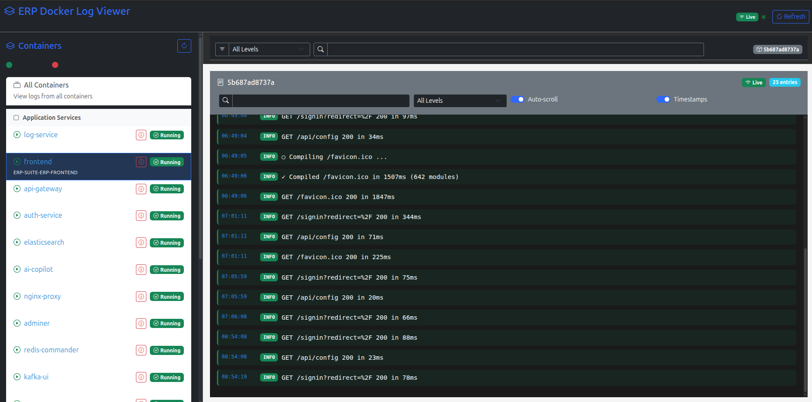
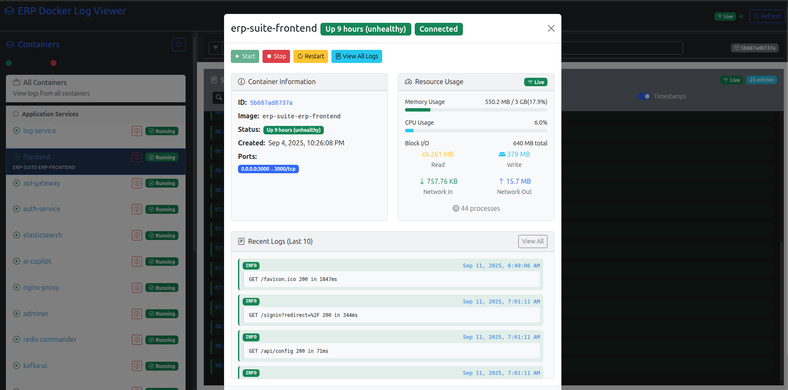

# ERP Log Service

Real-time Docker container log monitoring service for the ERP Suite.

## Features

- Real-time log streaming from Docker containers
- Container status monitoring (Running, Stopped, Created, Unknown)
- WebSocket-based log streaming
- Filter and search logs
- Responsive web interface
- Categorized container view (Application Services, Infrastructure)




## Architecture

- **Frontend**: React/TypeScript web interface (port 3004)
- **Backend**: FastAPI service (port 8093)
- **WebSocket**: Real-time log streaming
- **Docker**: Container management and log collection

## Prerequisites

- Docker and Docker Compose
- Node.js 16+ (for development)
- Python 3.9+ (for backend development)

# ERP Log Service Codebase Documentation

This document provides an overview of the ERP Log Service codebase, its architecture, and guidance for developers to understand and extend the project.

---

## Project Structure

```
erp-log-service/
├── backend/                     # Backend FastAPI service
│   ├── main.py                  # FastAPI application entry point
│   ├── requirements.txt         # Python dependencies
│   ├── .env.example            # Example environment variables
│   └── app/
│       ├── api/                # API endpoints and WebSocket handlers
│       │   ├── __init__.py
│       │   ├── endpoints/
│       │   │   ├── __init__.py
│       │   │   ├── logs.py     # Log-related endpoints
│       │   │   ├── stats.py    # Container statistics endpoints
│       │   │   └── health.py   # Health check endpoints
│       │   └── dependencies.py # API dependencies
│       │
│       ├── core/               # Core application components
│       │   ├── __init__.py
│       │   ├── config.py       # Application configuration
│       │   ├── connection_manager.py  # WebSocket connection management
│       │   └── logging_config.py      # Logging configuration
│       │
│       ├── models/             # Database models (if any)
│       │   └── __init__.py
│       │
│       ├── services/           # Business logic services
│       │   ├── __init__.py
│       │   ├── docker.py       # Docker container interactions
│       │   ├── log_processor.py # Log processing utilities
│       │   ├── log_streamer.py  # Real-time log streaming
│       │   └── stats_service.py # Container statistics collection
│       │
│       ├── utils/              # Utility functions
│       │   └── __init__.py
│       │
│       └── __init__.py
│
├── frontend/                   # React frontend application
│   ├── public/                 # Static assets
│   ├── src/
│   │   ├── components/         # React components
│   │   │   ├── common/         # Reusable UI components
│   │   │   ├── containers/     # Container components
│   │   │   ├── layout/         # Layout components
│   │   │   └── modals/         # Modal dialogs
│   │   │
│   │   ├── contexts/           # React contexts
│   │   │   ├── ContainerStatsContext.tsx
│   │   │   └── WebSocketContext.tsx
│   │   │
│   │   ├── hooks/              # Custom React hooks
│   │   │   ├── useContainerStats.ts
│   │   │   └── useLogMessages.ts
│   │   │
│   │   ├── services/           # API and service layer
│   │   │   ├── api.ts
│   │   │   ├── containerService.ts
│   │   │   └── websocketService.ts
│   │   │
│   │   ├── types/              # TypeScript type definitions
│   │   ├── utils/              # Utility functions
│   │   ├── App.tsx             # Root component
│   │   └── index.tsx           # Application entry point
│   │
│   ├── .env.example           # Example frontend environment variables
│   ├── package.json           # NPM dependencies
│   └── tsconfig.json          # TypeScript configuration
│
├── tests/                      # Test files
│   ├── unit/                  # Unit tests
│   └── integration/           # Integration tests
│
├── docker/                     # Docker-related files
│   ├── nginx/                 # Nginx configuration
│   └── scripts/               # Utility scripts
│
├── .dockerignore              # Files to exclude from Docker builds
├── .gitignore                 # Git ignore rules
├── docker-compose.yml         # Development Docker Compose file
├── docker-compose.prod.yml    # Production Docker Compose file
├── Dockerfile                 # Production Dockerfile
├── Dockerfile.dev             # Development Dockerfile
└── README.md                  # This file
```

---

## Backend (Python/FastAPI)

### Core Components
- **main.py**: FastAPI application entry point with WebSocket endpoints for logs and stats.
- **app/core/config.py**: Centralized configuration management using Pydantic settings.
- **app/core/connection_manager.py**: Manages WebSocket connections and broadcasting.
- **app/core/dependencies.py**: Dependency injection for services.

### API Endpoints
- **/api/v1/logs/containers**: List all containers
- **/api/v1/logs/containers/{id}/logs**: Get container logs
- **/ws/logs/{container_id}**: WebSocket for real-time logs
- **/ws/stats/{container_id}**: WebSocket for container statistics
- **/health**: Health check endpoint
- **/debug/routes**: List all registered routes
- **/debug/websockets**: Show active WebSocket connections

### Services
- **log_processor.py**: Processes and formats Docker logs
- **log_streamer.py**: Manages log streaming to WebSocket clients
- **docker.py**: Interacts with Docker daemon via CLI
- **stats.py**: Handles container statistics collection and streaming

### Key Features
- Real-time log streaming via WebSocket
- Container statistics (CPU, memory, network, disk)
- Graceful shutdown handling
- Connection health monitoring
- Support for multiple concurrent WebSocket connections
- Error handling and logging

---

## Frontend (React/TypeScript)

### Core Components
- **App.tsx**: Main application component with routing
- **ContainerList.tsx**: Lists all Docker containers with status
- **ContainerDetails.tsx**: Shows detailed container information and stats
- **LogsModal.tsx**: Displays container logs in a modal
- **ConnectionStatus.tsx**: Shows WebSocket connection status

### Contexts
- **ContainerStatsContext**: Manages container stats state
- **WebSocketContext**: Handles WebSocket connections

### Services
- **api.ts**: REST API client
- **containerService.ts**: Container management functions
- **websocketService.ts**: WebSocket client for real-time updates

### UI Features
- Real-time container status updates
- Interactive logs with auto-scroll
- Container statistics visualization
- Responsive design
- Connection status indicators
- Error handling and loading states

---

## Development & Extension

### Backend Development
1. **Add new endpoints**:
   - Create new router in `app/api/endpoints/`
   - Register in `app/api/__init__.py`

2. **Extend services**:
   - Add new methods to existing services
   - Create new services in `app/services/`

3. **Testing**:
   - Unit tests: `pytest tests/unit`
   - Integration tests: `pytest tests/integration`
   - Run tests with coverage: `pytest --cov=app`

### Frontend Development
1. **Add new components**:
   - Create React components in `src/components/`
   - Add TypeScript types in `src/types/`

2. **Extend API client**:
   - Add new methods to `src/services/api.ts`
   - Update WebSocket handlers in `src/services/websocketService.ts`

3. **Run development server**:
   ```bash
   cd frontend
   npm start
   ```

### Deployment
1. **Build production image**:
   ```bash
   docker-compose -f docker-compose.prod.yml build
   ```

2. **Start services**:
   ```bash
   docker-compose -f docker-compose.prod.yml up -d
   ```

3. **View logs**:
   ```bash
   docker-compose -f docker-compose.prod.yml logs -f
   ```

---

## API Reference

### WebSocket Endpoints

#### Logs WebSocket
- **URL**: `ws://<host>:<port>/ws/logs/{container_id}`
- **Parameters**:
  - `container_id`: Container ID or 'all' for all containers
- **Messages**:
  - Incoming: Filter and subscription messages
  - Outgoing: Log entries with metadata

#### Stats WebSocket
- **URL**: `ws://<host>:<port>/ws/stats/{container_id}`
- **Parameters**:
  - `container_id`: Container ID
- **Messages**:
  - Outgoing: Container statistics (CPU, memory, network, disk)

### REST API

#### List Containers
```
GET /api/v1/logs/containers
```

#### Get Container Logs
```
GET /api/v1/logs/containers/{id}/logs?tail=100&since=2023-01-01T00:00:00Z
```

#### Container Actions
- Start: `POST /api/v1/logs/containers/{id}/start`
- Stop: `POST /api/v1/logs/containers/{id}/stop`
- Restart: `POST /api/v1/logs/containers/{id}/restart`

---

## Troubleshooting

### Common Issues
1. **WebSocket connection fails**:
   - Check if backend service is running
   - Verify CORS and proxy settings
   - Check browser console for errors

2. **No logs appearing**:
   - Verify container is running
   - Check Docker daemon logs
   - Verify container has log output

3. **High CPU/Memory usage**:
   - Check for memory leaks in WebSocket handlers
   - Monitor WebSocket connection count
   - Review log processing logic

### Debugging
1. **Enable debug logging**:
   ```bash
   LOG_LEVEL=DEBUG uvicorn main:app --reload
   ```

2. **Inspect WebSocket traffic**:
   - Use browser developer tools
   - Check WebSocket frames in Network tab

---

## Running Locally

1. **Backend**:
   - Install Python dependencies: `pip install -r backend/requirements.txt`
   - Start FastAPI: `uvicorn backend.main:app --reload --port 8092`
2. **Frontend**:
   - Install Node dependencies: `cd frontend && npm install`
   - Start React app: `npm start`
3. **Docker Compose**:
   - Use `docker-compose.yml` for local dev environment.

---

## Useful Tips
- All logs are streamed and buffered per container for efficient real-time updates.
- Use the modal to view previous logs and color-coded log entries.
- Extend log parsing logic in `log_processor.py` for new log formats.
- Use type definitions in `src/types/` for consistent data handling.

---

## Contact & Contribution
- For questions, see `README.md` or contact the maintainers.
- Contributions welcome! Please follow the code structure and add documentation for new features.


## Quick Start

### Using Docker Compose

```bash
# Start the ERP Log Service with all dependencies
docker compose up -d
```

### Development Setup

#### Backend

```bash
# Navigate to backend directory
cd backend

# Create and activate virtual environment
python -m venv venv
source venv/bin/activate  # On Windows: .\venv\Scripts\activate

# Install dependencies
pip install -r requirements.txt

# Start the backend server
uvicorn app.main:app --reload --port 8093
```

#### Frontend

```bash
# Navigate to frontend directory
cd frontend

# Install dependencies
npm install

# Start the development server
npm start
```

## API Endpoints

### REST API

- `GET /api/v1/health` - Health check
- `GET /api/v1/containers` - List all containers
- `GET /api/v1/containers/{container_id}/logs` - Get historical logs for a container

### WebSocket Endpoints 

### Real-time Container Stats
- **Endpoint**: `ws://localhost:8093/ws/stats/{container_id}`
- **Purpose**: Stream real-time container statistics (CPU, memory, network, disk)
- **Update Frequency**: Every 1 second
- **Message Format**: 
  ```json
  {
    "type": "stats",
    "payload": {
      "containerId": "abc123",
      "cpuUsage": 8.33,
      "memoryUsage": 254.3,
      "memoryLimit": 512.0,
      "networkRx": 0,
      "networkTx": 0,
      "pids": 60
    }
  }
  ```

### Real-time Container Logs
- **Endpoint**: `ws://localhost:8093/ws/logs/{container_id}`
- **Purpose**: Stream real-time log entries from Docker containers
- **Message Format**: 
  ```json
  {
    "type": "log",
    "payload": {
      "container_id": "abc123",
      "timestamp": "2024-01-01T12:00:00Z",
      "message": "Log message content",
      "level": "INFO"
    }
  }
  ```

## Environment Variables

### Backend

```
LOG_LEVEL=info
DOCKER_HOST=unix:///var/run/docker.sock
REDIS_URL=redis://redis:6379/0
API_KEY=your-api-key
```

### Frontend

```
REACT_APP_API_URL=http://localhost:8093
REACT_APP_WS_URL=ws://localhost:8093
```

## Development

### Backend Testing

```bash
cd backend
pytest
```

### Frontend Testing

```bash
cd frontend
npm test
```

## Deployment

### Production Build

```bash
# Build frontend
cd frontend
npm run build

# Build and start containers
docker compose -f docker-compose.prod.yml up -d --build
```

## Troubleshooting

### WebSocket Connection Issues

1. Ensure the backend service is running and accessible
2. Verify the WebSocket URL is correct
3. Check browser console for any errors
4. Verify CORS and proxy settings

### Log Collection Issues

1. Check Docker daemon is running
2. Verify container permissions
3. Check backend logs for errors

## License

Built for UNIBASE ERP for infrastructure monitoring and logging.
